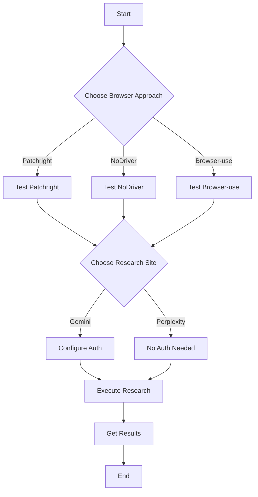
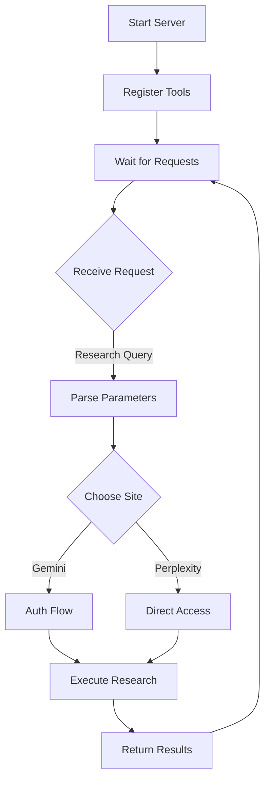
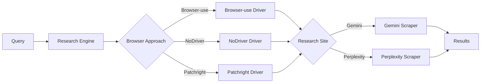
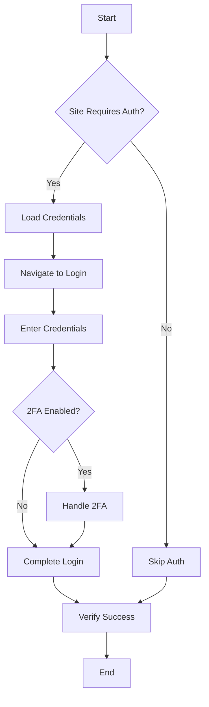

# Documentation

This folder contains technical documentation and diagrams explaining the system architecture and workflows.

## Diagrams

### System Architecture

- `diagrams/state.md`  
  Mermaid diagram showing high-level state transitions in the pipeline.
- `diagrams/sequence.md`  
  Sequence diagram showing how data flows between user, MCP server, plan tool, orchestration, etc.
- `diagrams/flow.md`  
  Flow diagram offering a visual representation of the end-to-end process.

### Workflow Diagrams

#### Testing Workflow

#### MCP Server Workflow

## Generating or Viewing Diagrams

Multiple approaches:
- Open `*.md` with a Mermaid-compatible viewer or use an online Mermaid renderer.
- Copy diagram content into a local or web-based Mermaid preview tool.

## Technical Details

### Research Engine Flow

### Authentication Flow

## Further References

- [mcp_server/README.md](../mcp_server/README.md) to understand how the server lifecycle and tools fit together.
- [../README.md](../README.md) for an overall project overview.
- [../scripts/README.md](../scripts/README.md) for test script usage.